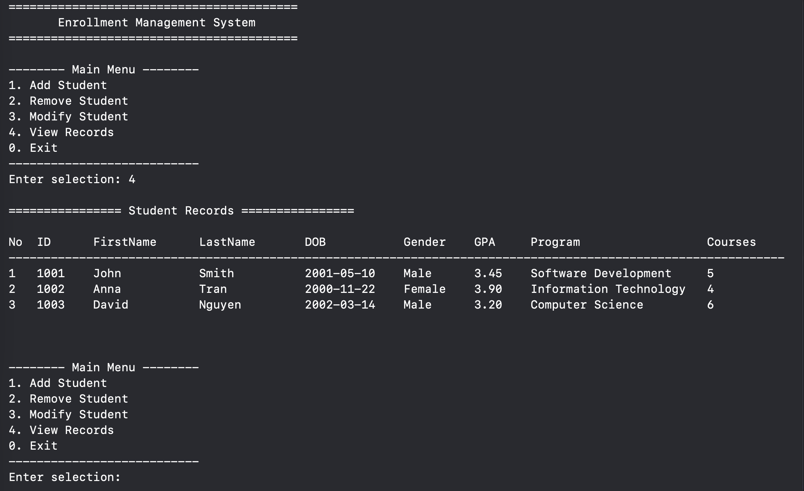

# Enrollment Management System – Part 2

## Overview

This program is a simple **Enrollment Management System**. It allows to manage student records.

The program can:

- Add a student
- Remove a student
- Modify student information
- View all student records
- Exit the program

The program is written in **Swift** and follows the pseudocode from Part 1.

Program UI


---

# Student Information
Each student record contains:
- Student ID
- First Name
- Last Name
- Date of Birth
- Gender
- Previous GPA
- Current Semester
- Program
- Number of Courses

---

# Variables
Examples:

```swift
var studentId: Int
var firstName: String
var previousGPA: Double
```

```swift
var studentList: [Student]
```

---

# Data Types

The program uses both **primitive** and **non-primitive data types**.

### Primitive Data Types
- `String` for names and text
- `Int` for numbers such as student ID and semester
- `Double` for GPA values

Example:

```swift
var studentId: Int
var previousGPA: Double
```

### Non-Primitive Data Types
- **Array type** to store multiple students
- **Struct type** to represent a student record

Example:

```swift
struct Student
var studentList: [Student]
```

---

# Data Binding

This program uses both **static binding** and **dynamic data structures**.

### Static Binding

Example:

```swift
var studentId: Int
var previousGPA: Double
```

Each variable has a fixed type. For example, `studentId` can only store integer values.

---

### Dynamic Data Structure

Example:

```swift
var studentList: [Student]
```

This array can change size during program execution. When a new student is added, the array grows. When a student is removed, the array becomes smaller.

---

# Scoping

Variables have different scopes depending on where they are declared.

Example:

```swift
func addStudent() {
    let firstName = InputHelper.readString(prompt: "First name:")
}
```

The variable `firstName` exists only inside the `addStudent()` function.

---

# Referencing

The program uses both **value types** and **reference types**.
In Swift, a **struct** is a value type. a **class** is a reference type.

### Value Type

```swift
struct Student
```

When a struct value is assigned or passed to a function, a copy of the data is created.

---

### Reference Type


```swift
class EnrollmentController
```

When a class object is assigned to another variable, both variables refer to the same object in memory.

# Subprograms

The program is divided into smaller subprograms.

Examples:

```
addStudent()
removeStudent()
modifyStudent()
displayStudents()
```

Each function performs a specific task in the system.

---

# Conditional Statements

The program uses conditional statements for decision making.

Examples used in the program:

```
if
switch
guard
```

Example:

```swift
switch option {
case .addStudent:
    addStudent()
case .removeStudent:
    removeStudent()
}
```

### Guard Statement

`guard` is commonly used in Swift to check a condition early in a function.

If the condition is not true, the program exits the current scope.

Example:

```swift
guard let index = findStudentIndex(by: studentId) else {
    print("Student not found")
    return
}
```

In this case, `guard` checks whether the student exists.   If the student is not found, the function stops and returns early.

---

# Loops

Loops are used to repeat operations.

Example:

```swift
while running {
    displayMenu()
}
```

Loops are also used to display student records.

```swift
for student in studentList {
    print(student)
}
```

---
